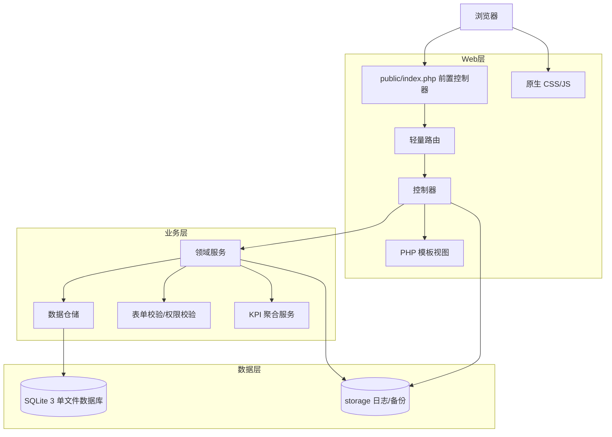
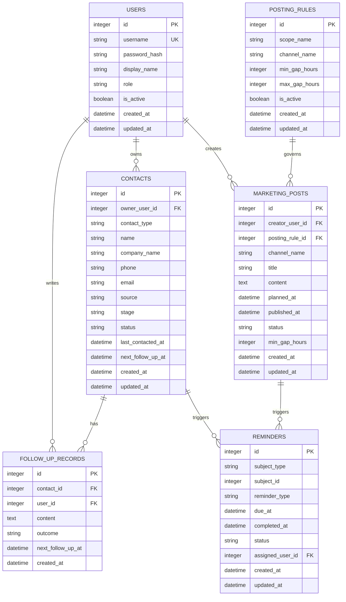
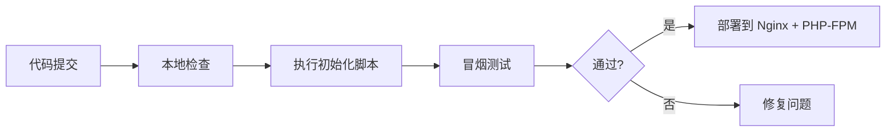

# 系统架构文档

## 文档信息
- **功能名称**：sales-crm
- **版本**：1.1
- **创建日期**：2026-04-15
- **作者**：Architect Agent

## 摘要

> 下游 Agent 请优先阅读本节，需要细节时再查阅完整文档。

- **架构模式**：单体应用
- **技术栈**：原生 PHP 8.5 / SQLite 3 / 原生 HTML + CSS + JavaScript / 本地开发 `php -S`，生产环境 `Nginx + PHP-FPM`
- **核心设计决策**：1) 不引入 Composer 和框架，使用前置控制器 + 轻量路由 + 分层服务；2) 用 SQLite 单文件数据库承载客户、潜客、跟进和营销排期数据，开启外键与 WAL；3) 认证采用 Session + CSRF，授权采用基于 owner 的两级角色作用域；4) KPI 由服务层统一聚合，避免在模板层拼统计 SQL
- **主要风险**：SQLite 并发写入能力有限、无 Composer 需要自行维护基础设施代码、当前角色模型仅覆盖 `manager / sales` 两级权限
- **项目结构**：`public/` 作为唯一 Web 入口，`app/` 承载控制器/服务/仓储，`database/` 存放 schema 和 SQLite 文件，`scripts/` 存放初始化与备份脚本，`storage/` 存放日志与备份

---
---

## 1. 架构概述

### 1.1 系统架构图



### 1.2 架构决策

| 决策 | 选项 | 选择 | 原因 |
|------|------|------|------|
| 前端形态 | SPA / SSR / 混合 | SSR 为主，少量原生 JS 增强 | CRM 的核心是列表、表单、提醒和排期，服务端渲染更省依赖、更易本地直跑，原生 JS 只负责弹窗、筛选、异步提交 |
| 后端实现 | Laravel / Slim / 原生 PHP | 原生 PHP 8.5 | 用户明确要求零依赖、无 Composer，本方案不引入框架，减少初始化成本和部署复杂度 |
| 数据存储 | MySQL / PostgreSQL / SQLite | SQLite 3 | 首版是单团队内部系统，SQLite 单文件、零运维，配合 WAL 和索引可满足当前写入量 |
| 通信方式 | 纯页面 / API-first | 页面 + JSON API 并存 | 页面负责主流程，JSON API 供原生 JS 做局部刷新和提交，避免过早做完整前后端分离 |
| 认证方式 | JWT / Session / OAuth | Session | 单体应用最适合 Session Cookie，配合 CSRF 更简单直接，不需要额外 Token 体系 |
| 授权方式 | 全量可见 / 两级角色 / 复杂 RBAC | 两级角色作用域 | 当前只需要 `manager` 看全量、`sales` 看本人数据，用查询作用域即可满足 |
| 缓存/消息队列 | Redis / MQ / 无 | 无 | 当前功能以 CRUD 和提醒计算为主，尚未出现需要缓存或异步消息的场景，避免把非 MVP 内容提前复杂化 |

### 1.3 技术方案调研

#### 原生 PHP 与框架对比

| 方案 | 优点 | 缺点 | 适用场景 | 推荐度 |
|------|------|------|----------|--------|
| 原生 PHP 8.5 + PDO | 零依赖、启动快、部署简单、完全符合“本机可直接运行” | 需要自己补路由、校验、视图和通用工具 | 小型内部系统、MVP、单团队工具 | 高 |
| Laravel | 生态成熟、开发效率高、文档丰富 | 依赖 Composer、项目体积更大、初始化成本高 | 中大型业务、多人协作、长期演进 | 中 |
| Slim | 比大型框架更轻 | 仍然需要 Composer 和额外约定 | 轻量 API 服务 | 中低 |

结论：本项目选择原生 PHP 8.5。根据 PHP 官方文档，`password_hash()` / `password_verify()`、PDO、Session、内建开发服务器都足以支撑首版 CRM。内建开发服务器仅用于本地开发，不作为生产部署方式。

#### 数据库方案对比

| 方案 | 类型 | 优点 | 缺点 | 适用场景 |
|------|------|------|------|----------|
| SQLite 3 | 嵌入式关系型 | 零配置、单文件、备份简单、适合本地直跑 | 并发写入受限 | 内部系统、原型、MVP |
| MySQL | 关系型 | 普及度高、工具丰富 | 需要独立服务、初始化更重 | 中小型生产系统 |
| PostgreSQL | 关系型 | 功能强、约束和查询能力更强 | 运维成本更高 | 复杂事务和分析型场景 |

结论：首版用 SQLite，开启外键、WAL 和 busy timeout，确保单机运行稳定；如果后续并发和报表需求上升，再平滑迁移到 PostgreSQL。

#### 开源方案评估

| 开源项目 | 功能 | 维护状态 | 是否采用 | 参考价值 |
|----------|------|----------|----------|----------|
| EspoCRM | 成熟 CRM、客户/活动/提醒齐全 | 活跃 | 否 | 提供 CRM 领域实体拆分思路，但整体栈和复杂度都明显超出首版 |
| SuiteCRM | 企业级 CRM、流程完整 | 活跃 | 否 | 适合较重的 CRM 场景，不适合当前零依赖和快速交付目标 |
| Crater | 简洁的 PHP Web 应用结构 | 活跃 | 否 | 可参考其轻量化页面组织和业务分层方式，但本项目不直接复用框架依赖 |

#### 调研结论

| 层级 | 推荐方案 | 选择理由 | 备选方案 |
|------|----------|----------|----------|
| 前端 | 原生 HTML + CSS + JavaScript | 零依赖、与 PHP SSR 配合自然、易快速交付 | 轻量前端框架 |
| 后端 | 原生 PHP 8.5 | 满足无 Composer 约束，部署最简单 | Laravel / Slim |
| 数据库 | SQLite 3 | 单文件、低运维、适合首版 | PostgreSQL |
| 缓存 | 无 | 当前没有明显收益 | 文件缓存 / Redis |
| 部署 | PHP 内建服务 + Nginx/PHP-FPM | 本地和生产都能保持同一代码路径 | Docker 化部署 |

---

## 2. 技术栈

| 层级 | 技术 | 版本 | 说明 |
|------|------|------|------|
| 前端框架 | 原生 HTML + CSS + JavaScript | ES2020+ | 不使用前端框架，页面以服务端渲染为主，少量 JS 处理异步提交、筛选和提醒交互 |
| UI 库 | 无 | - | 通过自定义 CSS 变量、布局和组件样式控制界面风格 |
| 后端框架 | 原生 PHP | 8.5 | 使用前置控制器、轻量路由、仓储和服务层，不依赖 Composer |
| 数据库 | SQLite | 3.x | 单文件数据库，开启外键约束、WAL 和合理索引 |
| 缓存 | 无 | - | 首版不引入缓存层 |
| 视图渲染 | PHP 模板 | - | 通过 `include` / 模板函数渲染页面 |
| 部署 | PHP 内建服务器 / Nginx + PHP-FPM | - | 本地开发直接运行，生产环境使用标准 Web 服务器 |

---

## 3. 目录结构

```
sales-crm/
├── public/                      # Web 入口，仅暴露这里
│   ├── index.php                # 前置控制器
│   └── assets/
│       ├── app.css              # 全局样式
│       └── app.js               # 原生交互脚本
├── app/                         # 业务代码
│   ├── Core/
│   │   ├── App.php              # 应用启动与依赖装配
│   │   ├── Router.php           # 轻量路由
│   │   ├── Request.php          # 请求对象
│   │   ├── Response.php         # 响应对象
│   │   ├── Database.php         # PDO 封装
│   │   ├── Session.php         # Session 封装
│   │   └── Csrf.php             # CSRF 令牌
│   ├── Controllers/
│   │   ├── AuthController.php
│   │   ├── ContactController.php
│   │   ├── FollowUpController.php
│   │   ├── ReminderController.php
│   │   └── MarketingPostController.php
│   ├── Domain/
│   │   ├── Entities/
│   │   ├── Repositories/
│   │   └── Services/
│   ├── Support/
│   │   ├── Validator.php
│   │   ├── Formatter.php
│   │   └── helpers.php
│   └── Views/
│       ├── layouts/
│       ├── auth/
│       ├── contacts/
│       ├── reminders/
│       └── marketing-posts/
├── config/
│   ├── app.php                  # 应用配置
│   └── database.php            # SQLite 配置
├── database/
│   ├── schema.sql               # 表结构
│   ├── seed.sql                 # 初始数据
│   └── crm.sqlite               # 本地数据库文件
├── scripts/
│   ├── init-db.php              # 初始化数据库
│   ├── seed-admin.php           # 创建首个管理员账号
│   └── backup-db.php            # 备份数据库
├── storage/
│   ├── logs/                    # 日志
│   └── backups/                 # 备份文件
└── tests/
    ├── unit/
    └── feature/
```

### 目录设计原则

1. `public/` 之外的目录不直接对外暴露，避免静态文件和源码泄露。
2. `Controllers` 只处理请求编排，不直接拼 SQL。
3. `Repositories` 负责数据库访问，`Services` 负责业务规则，例如跟进推进、提醒计算、发帖间距判断和 KPI 聚合。
4. `Views` 仅负责展示，不写复杂业务逻辑。
5. `scripts/` 放初始化、备份和维护脚本，确保无 Composer 环境也能完成基础运维。

---

## 4. 数据模型

### 4.1 实体关系图 (ERD)



### 4.2 数据字典

#### `users` 表

| 字段 | 类型 | 约束 | 说明 |
|------|------|------|------|
| id | INTEGER | PK | 主键 |
| username | VARCHAR(50) | UNIQUE, NOT NULL | 登录账号 |
| password_hash | VARCHAR(255) | NOT NULL | `password_hash()` 生成的密码哈希 |
| display_name | VARCHAR(100) | NOT NULL | 显示名称 |
| role | VARCHAR(20) | NOT NULL, DEFAULT 'operator' | 预留角色字段，首版只用于管理员/普通账号区分 |
| is_active | INTEGER | NOT NULL, DEFAULT 1 | 是否启用 |
| created_at | DATETIME | NOT NULL | 创建时间 |
| updated_at | DATETIME | NOT NULL | 更新时间 |

#### `contacts` 表

| 字段 | 类型 | 约束 | 说明 |
|------|------|------|------|
| id | INTEGER | PK | 主键 |
| owner_user_id | INTEGER | FK, NOT NULL | 负责该客户/潜客的销售 |
| contact_type | VARCHAR(20) | NOT NULL | `lead` 或 `customer` |
| name | VARCHAR(100) | NOT NULL | 联系人名称 |
| company_name | VARCHAR(150) | NULL | 公司名称 |
| phone | VARCHAR(30) | NULL | 电话 |
| email | VARCHAR(120) | NULL | 邮箱 |
| source | VARCHAR(100) | NULL | 来源，例如转介绍、自然获客、活动 |
| stage | VARCHAR(30) | NOT NULL | 跟进阶段，例如新建、跟进中、待成交、已成交、流失 |
| status | VARCHAR(20) | NOT NULL | 状态，例如 active、archived |
| last_contacted_at | DATETIME | NULL | 最近一次联系时间 |
| next_follow_up_at | DATETIME | NULL | 下次回访时间 |
| created_at | DATETIME | NOT NULL | 创建时间 |
| updated_at | DATETIME | NOT NULL | 更新时间 |

#### `follow_up_records` 表

| 字段 | 类型 | 约束 | 说明 |
|------|------|------|------|
| id | INTEGER | PK | 主键 |
| contact_id | INTEGER | FK, NOT NULL | 关联客户/潜客 |
| user_id | INTEGER | FK, NOT NULL | 记录人 |
| content | TEXT | NOT NULL | 跟进内容 |
| outcome | VARCHAR(50) | NULL | 本次结果，例如已约访、已报价 |
| next_follow_up_at | DATETIME | NULL | 下一次跟进时间 |
| created_at | DATETIME | NOT NULL | 创建时间 |

#### `marketing_posts` 表

| 字段 | 类型 | 约束 | 说明 |
|------|------|------|------|
| id | INTEGER | PK | 主键 |
| creator_user_id | INTEGER | FK, NOT NULL | 创建人 |
| posting_rule_id | INTEGER | FK, NULL | 对应发帖规则 |
| channel_name | VARCHAR(50) | NOT NULL | 发帖渠道，例如朋友圈、微博、公众号 |
| title | VARCHAR(200) | NOT NULL | 标题 |
| content | TEXT | NOT NULL | 内容摘要或正文 |
| planned_at | DATETIME | NOT NULL | 计划发布时间 |
| published_at | DATETIME | NULL | 实际发布时间 |
| status | VARCHAR(20) | NOT NULL | `planned` / `published` / `skipped` |
| min_gap_hours | INTEGER | NOT NULL, DEFAULT 0 | 当前记录采用的最小发帖间隔，便于审计 |
| created_at | DATETIME | NOT NULL | 创建时间 |
| updated_at | DATETIME | NOT NULL | 更新时间 |

#### `posting_rules` 表

| 字段 | 类型 | 约束 | 说明 |
|------|------|------|------|
| id | INTEGER | PK | 主键 |
| scope_name | VARCHAR(50) | NOT NULL | 规则范围名称，首版可按团队或渠道区分 |
| channel_name | VARCHAR(50) | NOT NULL | 渠道名称 |
| min_gap_hours | INTEGER | NOT NULL | 最小发帖间隔 |
| max_gap_hours | INTEGER | NULL | 最大断更提醒阈值 |
| is_active | INTEGER | NOT NULL, DEFAULT 1 | 是否启用 |
| created_at | DATETIME | NOT NULL | 创建时间 |
| updated_at | DATETIME | NOT NULL | 更新时间 |

#### `reminders` 表

| 字段 | 类型 | 约束 | 说明 |
|------|------|------|------|
| id | INTEGER | PK | 主键 |
| subject_type | VARCHAR(20) | NOT NULL | `contact` 或 `marketing_post` |
| subject_id | INTEGER | NOT NULL | 关联对象 ID |
| reminder_type | VARCHAR(30) | NOT NULL | `follow_up_due` / `post_gap_due` / `post_gap_warning` |
| due_at | DATETIME | NOT NULL | 提醒到期时间 |
| completed_at | DATETIME | NULL | 完成时间 |
| status | VARCHAR(20) | NOT NULL | `open` / `done` / `ignored` |
| assigned_user_id | INTEGER | FK, NOT NULL | 提醒负责人 |
| created_at | DATETIME | NOT NULL | 创建时间 |
| updated_at | DATETIME | NOT NULL | 更新时间 |

### 4.3 数据设计说明

1. 现有客户和潜在客户统一放入 `contacts` 表，通过 `contact_type` 和 `stage` 区分，避免重复建表。
2. 跟进记录单独成表，便于保留完整历史，不会被后续编辑覆盖。
3. 发帖间距采用 `posting_rules` + `marketing_posts` 的组合，既能表达规则，又能保留每次发帖的审计信息。
4. 提醒表采用 `subject_type + subject_id` 的通用关联方式，后续可继续挂接 KPI 或其他对象。
5. SQLite 连接初始化时必须执行 `PRAGMA foreign_keys = ON;` 和 `PRAGMA journal_mode = WAL;`，避免默认行为导致约束失效或写入性能不足。

---

## 5. API 设计

### 5.1 API 规范

- **风格**：RESTful + 页面路由并存
- **版本**：统一使用 `/api/v1`
- **认证**：Session Cookie
- **格式**：JSON
- **前端交互**：页面以服务器渲染为主，局部操作通过原生 `fetch` 调用 JSON 接口

### 5.2 接口列表

| 模块 | 方法 | 路径 | 描述 | 认证 |
|------|------|------|------|------|
| **认证** | | | | |
| | GET | /login | 登录页 | 否 |
| | POST | /api/v1/auth/login | 登录 | 否 |
| | POST | /api/v1/auth/logout | 退出登录 | 是 |
| | GET | /api/v1/auth/me | 当前登录用户 | 是 |
| **客户与潜客** | | | | |
| | GET | /contacts | 客户列表页 | 是 |
| | GET | /api/v1/contacts | 客户/潜客列表 | 是 |
| | GET | /api/v1/contacts/{id} | 详情 | 是 |
| | POST | /api/v1/contacts | 新建客户/潜客 | 是 |
| | PUT | /api/v1/contacts/{id} | 更新客户/潜客 | 是 |
| | DELETE | /api/v1/contacts/{id} | 归档/删除 | 是 |
| **跟进记录** | | | | |
| | GET | /api/v1/contacts/{id}/follow-ups | 跟进历史列表 | 是 |
| | POST | /api/v1/contacts/{id}/follow-ups | 新增跟进记录 | 是 |
| **提醒** | | | | |
| | GET | /reminders | 提醒页 | 是 |
| | GET | /api/v1/reminders | 提醒列表 | 是 |
| | POST | /api/v1/reminders/{id}/complete | 标记完成 | 是 |
| | POST | /api/v1/reminders/{id}/ignore | 忽略提醒 | 是 |
| **营销帖子** | | | | |
| | GET | /marketing-posts | 排期页 | 是 |
| | GET | /api/v1/marketing-posts | 发帖列表 | 是 |
| | GET | /api/v1/marketing-posts/{id} | 发帖详情 | 是 |
| | POST | /api/v1/marketing-posts | 创建排期 | 是 |
| | PUT | /api/v1/marketing-posts/{id} | 更新排期 | 是 |
| | DELETE | /api/v1/marketing-posts/{id} | 删除排期 | 是 |
| **发帖规则** | | | | |
| | GET | /settings/posting-rules | 规则配置页 | 是 |
| | GET | /api/v1/posting-rules | 规则列表 | 是 |
| | POST | /api/v1/posting-rules | 新建规则 | 是 |
| | PUT | /api/v1/posting-rules/{id} | 更新规则 | 是 |

### 5.3 接口详情

#### GET /api/v1/contacts

**描述**：获取客户和潜客列表，支持按类型、阶段、负责人、关键词过滤。

**查询参数**：
| 参数 | 类型 | 必填 | 说明 |
|------|------|------|------|
| page | number | 否 | 页码，默认 1 |
| limit | number | 否 | 每页条数，默认 20 |
| contact_type | string | 否 | `lead` / `customer` |
| stage | string | 否 | 跟进阶段 |
| owner_user_id | number | 否 | 负责人 |
| q | string | 否 | 关键词，匹配姓名、公司、电话 |

**响应**：
```json
{
  "success": true,
  "data": {
    "items": [],
    "total": 0,
    "page": 1,
    "limit": 20
  }
}
```

#### POST /api/v1/contacts

**描述**：创建一个客户或潜客。

**请求体**：
```json
{
  "contact_type": "lead",
  "name": "张三",
  "company_name": "示例公司",
  "phone": "13800000000",
  "email": "zhangsan@example.com",
  "source": "转介绍",
  "stage": "new",
  "next_follow_up_at": "2026-04-18 10:00:00"
}
```

**规则**：
- `name` 必填
- `contact_type` 只能是 `lead` 或 `customer`
- `next_follow_up_at` 可选，但若填写必须为合法时间格式

#### POST /api/v1/marketing-posts

**描述**：创建营销帖子排期，并自动校验发帖间距。

**请求体**：
```json
{
  "channel_name": "朋友圈",
  "title": "新品发布",
  "content": "……",
  "planned_at": "2026-04-20 09:00:00",
  "posting_rule_id": 1
}
```

**业务校验**：
- 若与同渠道最近一次已发布或已计划帖子间隔小于最小阈值，返回校验错误
- 若距离上次发布时间过久，生成断更提醒

### 5.4 响应格式

**成功响应**：
```json
{
  "success": true,
  "data": { }
}
```

**列表响应**：
```json
{
  "success": true,
  "data": {
    "items": [],
    "total": 0,
    "page": 1,
    "limit": 20
  }
}
```

**错误响应**：
```json
{
  "success": false,
  "error": {
    "code": "VALIDATION_ERROR",
    "message": "请输入客户名称",
    "details": [
      {
        "field": "name",
        "message": "客户名称不能为空"
      }
    ]
  }
}
```

---

## 6. 安全设计

### 6.1 认证方案

| 方案 | 说明 |
|------|------|
| Session | 适合单体应用，依赖少，和服务端渲染天然匹配 |
| JWT | 更适合分离式架构，但对当前首版没有必要 |
| OAuth2 | 仅在后续需要第三方登录时考虑 |

**本项目采用**：Session Cookie。登录成功后把会话标识写入 HttpOnly Cookie，后端通过 Session 维护登录态。

### 6.2 授权模型

| 模型 | 说明 | 适用场景 |
|------|------|----------|
| RBAC | 基于角色的访问控制 | 适合复杂权限矩阵 |
| ABAC | 基于属性的访问控制 | 更灵活但实现成本更高 |

**本项目采用**：轻量角色 + 资源归属控制。

首版不做复杂 RBAC，只保留 `users.role` 作为未来扩展位。当前主要控制逻辑是：
- 已登录用户才能访问系统
- 普通用户只能编辑自己负责的客户和自己创建的发帖记录
- 管理员可以维护规则和查看全部数据

### 6.3 安全措施

| 风险 | 防护措施 | 实现方式 |
|------|----------|----------|
| XSS | 输出转义 | 模板默认转义，展示正文时只允许安全文本 |
| CSRF | Token 验证 | 所有写操作附带 CSRF 令牌 |
| SQL 注入 | 参数化查询 | PDO Prepared Statement，不拼接用户输入 |
| 暴力破解 | 登录限流 | 简单的 Session/IP 级失败计数和冷却时间 |
| 会话固定 | 重建 Session | 登录后调用 `session_regenerate_id(true)` |
| 密码泄露 | 哈希存储 | `password_hash()` / `password_verify()` |
| 敏感文件暴露 | 路径隔离 | Web 根目录只指向 `public/` |
| SQLite 并发写冲突 | WAL + busy timeout | 连接初始化时开启 WAL 并设置等待时间 |

### 6.4 连接与配置建议

1. `session.cookie_httponly=1`，`session.cookie_samesite=Lax`，生产环境启用 `Secure`。
2. 所有 POST/PUT/DELETE 请求必须校验 CSRF Token。
3. 数据库文件放在 `database/`，禁止直接通过 Web 访问。
4. `storage/` 目录只给 PHP 运行用户写权限，避免日志和备份泄露。

---

## 7. 部署架构

### 7.1 环境

| 环境 | 用途 | URL | 说明 |
|------|------|-----|------|
| 开发 | 本地开发 | `http://127.0.0.1:8000` | 直接使用 `php -S 127.0.0.1:8000 -t public`，适合快速启动 |
| 测试 | 功能验证 | 内网地址 | 可复用生产同构配置，只替换数据库文件 |
| 生产 | 正式服务 | 域名地址 | 使用 Nginx + PHP-FPM，前置代理到 `public/` |

### 7.2 部署流程



### 7.3 部署建议

1. 本地开发直接运行 `php -S 127.0.0.1:8000 -t public`，无需 Composer。
2. 首次部署前执行 `php scripts/init-db.php` 创建表结构，再执行 `php scripts/seed-admin.php` 创建首个管理员。
3. 生产环境使用 Nginx 指向 `public/` 目录，PHP 通过 FPM 进程池运行。
4. 每日用 `scripts/backup-db.php` 备份 SQLite 文件到 `storage/backups/`，并定期离线复制。
5. 如果后续并发增长明显，再迁移到 PostgreSQL，而不是提前引入复杂中间件。

---

## 8. 性能考虑

### 8.1 性能目标

| 指标 | 目标值 | 说明 |
|------|--------|------|
| 页面首屏可用 | < 2s | 内网或本地环境下的常规列表页 |
| 列表接口响应 | < 200ms | 95% 请求在小数据量下完成 |
| 数据规模 | 1 万级客户/潜客 | 首版目标规模 |
| 写入延迟 | < 100ms | 单条客户、跟进、排期写入 |

### 8.2 优化策略

- [ ] 对 `contacts(owner_user_id, stage, next_follow_up_at)` 建联合索引
- [ ] 对 `follow_up_records(contact_id, created_at)` 建索引
- [ ] 对 `marketing_posts(channel_name, planned_at, published_at)` 建索引
- [ ] SQLite 连接启用 WAL、foreign keys 和 busy timeout
- [ ] 列表页统一分页，默认每页 20 条，避免一次性拉全量
- [ ] 跟进和发帖间距判断只取必要字段，避免不必要的多表扫描
- [ ] KPI 第二阶段若上线，优先从现有业务表做聚合，而不是先做独立报表系统

### 8.3 扩展路径

1. 如果后续需要更复杂的分析报表，可以在不改主流程的情况下增加聚合表。
2. 如果需要多账号协作和更细权限，再把 `users.role` 扩展为完整权限矩阵。
3. 如果数据量和并发持续增长，再从 SQLite 平滑迁移到 PostgreSQL，保持 SQL 层抽象不变。

---

## 变更记录

| 版本 | 日期 | 作者 | 变更内容 |
|------|------|------|----------|
| 1.0 | 2026-04-15 | Architect Agent | 初始版本 |
