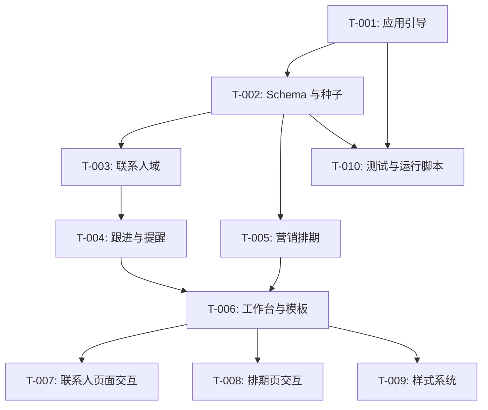

# 开发任务规格文档

## 文档信息
- **功能名称**：销售 CRM 系统
- **版本**：1.1
- **创建日期**：2026-04-15
- **作者**：Scrum Master Agent
- **关联故事**：`.boss/sales-crm/prd.md`

## 摘要

> 下游 Agent 请优先阅读本节，需要细节时再查阅完整文档。

- **任务总数**：12 个
- **前端任务**：4 个
- **后端任务**：6 个
- **关键路径**：T-001 → T-002 → T-003 → T-004 → T-006 → T-007 → T-008
- **预估复杂度**：高

---

## 1. 任务概览

### 1.1 统计信息
| 指标 | 数量 |
|------|------|
| 总任务数 | 12 |
| 创建文件 | 34 |
| 修改文件 | 8 |
| 测试用例 | 20 |

### 1.2 任务分布
| 复杂度 | 数量 |
|--------|------|
| 低 | 0 |
| 中 | 7 |
| 高 | 3 |

---

## 2. 任务详情

### Story: S-001 - 销售 CRM 首版闭环

首版目标是把客户/潜客管理、跟进回访、营销帖排期和发帖间距提醒跑通，并补齐工作台、样式、测试与运行脚本，确保前后端 worker 可以按文件直接落地。

### Story: S-002 - 第二阶段 KPI 与角色权限

第二阶段目标是在现有 CRM 闭环上补齐 `manager / sales` 两级权限，以及一个可直接给销售与管理层使用的 KPI 看板，保证不同角色进入系统后看到的数据范围和经营视角都正确。

#### Task T-011：基础角色权限收口

**类型**：修改

**目标文件**：
| 文件路径 | 操作 | 说明 |
|----------|------|------|
| `app/Core/App.php` | 修改 | 将当前登录用户显式传入控制器和服务层 |
| `app/Domain/Services/AccessService.php` | 创建 | 统一定义角色判断与查询作用域 |
| `app/Domain/Repositories/*.php` | 修改 | 在客户、提醒、排期等查询上追加 owner / assignee 作用域 |
| `app/Controllers/*.php` | 修改 | 写操作与详情查看统一走作用域校验 |

**完成标志**：
- [ ] `sales` 只能看到自己负责的数据
- [ ] `manager` 可以查看团队全量数据

#### Task T-012：KPI 看板与快照

**类型**：创建 / 修改

**目标文件**：
| 文件路径 | 操作 | 说明 |
|----------|------|------|
| `app/Domain/Services/KpiService.php` | 创建 | 聚合客户池、跟进、提醒和排期指标 |
| `app/Controllers/KpiController.php` | 创建 | 提供 `/kpi` 页面 |
| `app/Views/kpi/index.php` | 创建 | 呈现角色化 KPI 看板 |
| `app/Views/workbench/index.php` | 修改 | 在首页增加 KPI 快照 |
| `tests/feature/KpiDashboardTest.php` | 创建 | 验证管理层与销售视角差异 |
| `tests/feature/PermissionsScopeTest.php` | 创建 | 验证角色数据边界 |

**完成标志**：
- [ ] 工作台可看到 KPI 快照
- [ ] `/kpi` 可展示个人或团队 KPI
- [ ] 自动化测试覆盖角色与看板主路径

---

#### Task T-001：应用引导与运行时骨架

**类型**：创建 / 修改

**目标文件**：
| 文件路径 | 操作 | 说明 |
|----------|------|------|
| `public/index.php` | 创建 | 作为唯一 Web 入口，负责加载配置、初始化应用与分发路由 |
| `config/app.php` | 创建 | 应用基础配置、默认时区、分页大小、调试开关 |
| `config/database.php` | 创建 | SQLite 路径、WAL、busy timeout 等数据库配置 |
| `app/Core/App.php` | 创建 | 应用装配器，组合请求、路由、控制器和视图渲染 |
| `app/Core/Router.php` | 创建 | 轻量路由器，支持页面路由和 JSON API 路由 |
| `app/Core/Request.php` | 创建 | 请求解析与参数读取 |
| `app/Core/Response.php` | 创建 | HTML/JSON/重定向响应封装 |
| `app/Core/Database.php` | 创建 | PDO 初始化、连接复用、PRAGMA 设置 |
| `app/Core/Session.php` | 创建 | Session 启动与闪存消息封装 |
| `app/Core/Csrf.php` | 创建 | CSRF 令牌生成与校验 |
| `app/Support/helpers.php` | 创建 | `render()`、`json_response()`、`redirect()` 等通用辅助函数 |

**实现步骤**：
1. 建立零依赖启动链，`public/index.php` 只做最薄入口，所有共享逻辑收敛到 `app/Core`。
2. 实现路由注册与分发，至少预留 `/`、`/contacts`、`/reminders`、`/marketing-posts`、`/api/v1/*`。
3. 完成数据库连接和 Session/CSRF 初始化，确保后续控制器可直接复用。
4. 定义统一的 HTML、JSON、错误响应入口，避免各控制器重复写模板拼接逻辑。

**测试用例**：

文件：`tests/Unit/Core/RouterTest.php`
- [ ] 测试用例 1：可以解析静态路由与参数路由
- [ ] 测试用例 2：未知路由返回 404

文件：`tests/Feature/BootstrapSmokeTest.php`
- [ ] 测试用例 3：入口文件可以完成应用启动
- [ ] 测试用例 4：数据库和 Session 初始化不报错

**复杂度**：高

**依赖**：无

**注意事项**：
- 路由规则要稳定，后续控制器只需补充处理器，不要改入口协议。
- 数据库封装必须支持后续仓储层直接注入。

**完成标志**：
- [ ] `public/index.php` 可直接启动页面
- [ ] 路由、请求、响应、数据库基础对象可复用

---

#### Task T-002：SQLite Schema、种子与维护脚本

**类型**：创建 / 修改

**目标文件**：
| 文件路径 | 操作 | 说明 |
|----------|------|------|
| `database/schema.sql` | 创建 | 定义 `users`、`contacts`、`follow_up_records`、`marketing_posts`、`posting_rules`、`reminders` 表结构和索引 |
| `database/seed.sql` | 创建 | 写入首批管理员、默认发帖规则和示例客户数据 |
| `scripts/init-db.php` | 创建 | 初始化 SQLite 文件、执行 schema、开启外键和 WAL |
| `scripts/seed-admin.php` | 创建 | 生成或补充首个管理员账号 |
| `scripts/backup-db.php` | 创建 | 备份数据库到 `storage/backups/` |

**实现步骤**：
1. 先落 `schema.sql`，把主键、外键、唯一约束、常用查询索引一次设计完整。
2. 在 seed 中写入最小可用样本数据，保证页面和测试能直接跑起来。
3. `init-db.php` 要做到幂等，可重复执行而不破坏已有数据。
4. 备份脚本要按日期生成文件名，方便后续排障和回滚。

**测试用例**：

文件：`tests/Feature/DatabaseInitTest.php`
- [ ] 测试用例 1：首次执行后数据库文件和所有表都存在
- [ ] 测试用例 2：重复执行初始化脚本不会破坏既有数据

文件：`tests/Feature/SeedDataTest.php`
- [ ] 测试用例 3：默认管理员和默认规则可以被查询到
- [ ] 测试用例 4：示例数据满足列表页最小展示需要

**复杂度**：中

**依赖**：T-001

**注意事项**：
- SQLite 必须显式开启外键约束和 WAL。
- 预留 `min_gap_hours`、`next_follow_up_at`、`status` 等字段，避免首版后续扩表。

---

#### Task T-003：联系人与潜客域实现

**类型**：创建 / 修改

**目标文件**：
| 文件路径 | 操作 | 说明 |
|----------|------|------|
| `app/Controllers/ContactController.php` | 创建 | 处理客户/潜客列表、详情、新建、编辑、归档请求 |
| `app/Domain/Entities/Contact.php` | 创建 | 联系人实体，统一表达 `lead` 和 `customer` |
| `app/Domain/Repositories/ContactRepository.php` | 创建 | 联系人数据访问、分页、筛选、写入 |
| `app/Domain/Services/ContactService.php` | 创建 | 阶段流转、搜索条件组装、回访时间更新 |
| `app/Views/contacts/index.php` | 创建 | 客户/潜客列表页 |
| `app/Views/contacts/show.php` | 创建 | 客户详情页 |
| `app/Views/contacts/form.php` | 创建 | 新建/编辑表单 |
| `public/index.php` | 修改 | 注册联系人相关页面路由与 API 路由 |

**实现步骤**：
1. 先打通 `contacts` 的仓储层，统一处理分页、关键词、类型、阶段、负责人筛选。
2. 在 service 层封装“创建/编辑/归档/推进阶段”逻辑，控制器只做输入输出编排。
3. 详情页展示基础资料、阶段、最近跟进和下一次回访，后续模块直接挂载到详情页。
4. 列表页保留高频字段，方便销售和管理层快速判断状态。

**测试用例**：

文件：`tests/Unit/Domain/ContactServiceTest.php`
- [ ] 测试用例 1：创建联系人时能正确区分 `lead` 和 `customer`
- [ ] 测试用例 2：筛选条件可以正确组合成查询参数

文件：`tests/Feature/ContactsCrudTest.php`
- [ ] 测试用例 3：联系人列表可以展示种子数据
- [ ] 测试用例 4：新建和编辑联系人请求可以成功落库

**复杂度**：高

**依赖**：T-001, T-002

**注意事项**：
- `contacts` 是后续跟进和提醒的主对象，字段命名要稳定。
- 现有客户与潜在客户统一建模，不要拆成两张表。

---

#### Task T-004：跟进记录、回访提醒与时间轴

**类型**：创建 / 修改

**目标文件**：
| 文件路径 | 操作 | 说明 |
|----------|------|------|
| `app/Controllers/FollowUpController.php` | 创建 | 新增跟进记录接口和表单提交处理 |
| `app/Controllers/ReminderController.php` | 创建 | 提醒列表、完成、忽略、待办统计 |
| `app/Domain/Entities/FollowUpRecord.php` | 创建 | 跟进记录实体 |
| `app/Domain/Entities/Reminder.php` | 创建 | 提醒实体 |
| `app/Domain/Repositories/FollowUpRepository.php` | 创建 | 跟进记录写入与时间轴读取 |
| `app/Domain/Repositories/ReminderRepository.php` | 创建 | 提醒创建、查询、状态更新 |
| `app/Domain/Services/FollowUpService.php` | 创建 | 跟进记录落库后同步更新下次回访时间和最近联系时间 |
| `app/Domain/Services/ReminderService.php` | 创建 | 到期提醒计算、待办汇总、完成/忽略处理 |
| `app/Views/contacts/_timeline.php` | 创建 | 客户详情的跟进时间轴局部模板 |
| `app/Views/reminders/index.php` | 创建 | 提醒列表页 |
| `app/Views/contacts/show.php` | 修改 | 挂载时间轴和快速新增跟进入口 |

**实现步骤**：
1. 跟进记录以追加写方式保存，历史不可覆盖，确保销售沟通链路完整。
2. 保存跟进后同步更新 `contacts.last_contacted_at` 和 `contacts.next_follow_up_at`。
3. 提醒服务统一计算“到期前”“到期时”“超期”三类状态，列表页只消费结果。
4. 时间轴默认展开最新一条，历史记录可折叠，适合高频查看。

**测试用例**：

文件：`tests/Unit/Domain/ReminderServiceTest.php`
- [ ] 测试用例 1：回访到期时间可以生成 open 状态提醒
- [ ] 测试用例 2：完成和忽略后状态可以正确流转

文件：`tests/Feature/FollowUpReminderFlowTest.php`
- [ ] 测试用例 3：新增跟进后时间轴能读取到新记录
- [ ] 测试用例 4：回访提醒列表可以展示待办与超期项

**复杂度**：中

**依赖**：T-003

**注意事项**：
- 提醒对象采用通用关联，后续可继续挂接营销帖或 KPI。
- 跟进记录与回访提醒要避免重复建模，优先从跟进动作派生提醒。

---

#### Task T-005：营销帖排期与发帖间距校验

**类型**：创建 / 修改

**目标文件**：
| 文件路径 | 操作 | 说明 |
|----------|------|------|
| `app/Controllers/MarketingPostController.php` | 创建 | 排期列表、新增、编辑、删除、详情 |
| `app/Domain/Entities/MarketingPost.php` | 创建 | 营销帖实体 |
| `app/Domain/Entities/PostingRule.php` | 创建 | 发帖规则实体 |
| `app/Domain/Repositories/MarketingPostRepository.php` | 创建 | 排期数据读取与写入 |
| `app/Domain/Repositories/PostingRuleRepository.php` | 创建 | 规则读取与维护 |
| `app/Domain/Services/MarketingPostService.php` | 创建 | 发帖间距判断、断更风险计算、提醒生成 |
| `app/Domain/Services/PostingRuleService.php` | 创建 | 默认规则加载与规则更新校验 |
| `app/Views/marketing-posts/index.php` | 创建 | 排期列表和日历视图 |
| `app/Views/marketing-posts/show.php` | 创建 | 排期详情页 |
| `app/Views/marketing-posts/form.php` | 创建 | 新增/编辑排期表单 |

**实现步骤**：
1. 先把规则和帖子分开建模，避免把“规则配置”和“具体发帖记录”混在一起。
2. 新增或调整排期时调用 service 进行间距校验，返回“过密”或“断更”风险。
3. 在列表页展示计划时间、实际发布时间、状态和间距提示，方便运营快速判断。
4. 默认以渠道为维度计算最近一条帖子，保持规则简单可理解。

**测试用例**：

文件：`tests/Unit/Domain/PostingRuleServiceTest.php`
- [ ] 测试用例 1：默认规则可以被正确加载
- [ ] 测试用例 2：规则更新后间隔阈值可以生效

文件：`tests/Feature/MarketingPostGapTest.php`
- [ ] 测试用例 3：发帖时间过近时返回过密提醒
- [ ] 测试用例 4：长时间未发帖时返回断更提醒

**复杂度**：高

**依赖**：T-001, T-002

**注意事项**：
- 发帖间距必须保留审计字段 `min_gap_hours`，便于解释历史校验结果。
- 首版先按渠道级别校验，不引入复杂多维排期算法。

---

#### Task T-006：工作台首页与通用页面模板

**类型**：创建 / 修改

**目标文件**：
| 文件路径 | 操作 | 说明 |
|----------|------|------|
| `app/Controllers/WorkbenchController.php` | 创建 | 工作台首页、今日待办和关键摘要 |
| `app/Views/layouts/app.php` | 创建 | 全站基础布局 |
| `app/Views/layouts/partials/nav.php` | 创建 | 顶部导航与侧边导航 |
| `app/Views/workbench/index.php` | 创建 | 工作台首页模板 |
| `app/Views/components/summary-card.php` | 创建 | 通用摘要卡片组件 |
| `app/Views/components/status-badge.php` | 创建 | 通用状态标签组件 |

**实现步骤**：
1. 先建立统一布局和导航，后续各业务页只需要填内容区。
2. 工作台首页聚合客户数量、待回访数量、待发布帖子和间距风险，形成首屏判断。
3. 摘要卡片和状态标签做成可复用模板，减少各模块重复写样式。
4. 工作台页面保持运营工作台风格，信息密度高但层次清晰。

**测试用例**：

文件：`tests/Feature/WorkbenchRenderTest.php`
- [ ] 测试用例 1：工作台首页可以正常渲染
- [ ] 测试用例 2：关键摘要区能展示统计数字

文件：`tests/Feature/LayoutSmokeTest.php`
- [ ] 测试用例 3：导航链接和布局容器存在
- [ ] 测试用例 4：全站模板可被各页面复用

**复杂度**：中

**依赖**：T-003, T-004, T-005

**注意事项**：
- 这个任务是所有页面的共用壳，不能在局部页面里重复造布局。
- 首屏摘要的数据口径要和后续列表保持一致。

---

#### Task T-007：客户列表、详情页面与快速操作交互

**类型**：创建 / 修改

**目标文件**：
| 文件路径 | 操作 | 说明 |
|----------|------|------|
| `app/Views/contacts/index.php` | 修改 | 列表页升级为高密度工作台视图 |
| `app/Views/contacts/show.php` | 修改 | 详情页支持跟进、回访和编辑快速操作 |
| `app/Views/components/drawer.php` | 创建 | 快速录入抽屉通用组件 |
| `app/Views/components/filter-bar.php` | 创建 | 搜索与筛选栏组件 |
| `public/assets/app.js` | 创建 | 抽屉打开/关闭、局部提交、筛选交互 |

**实现步骤**：
1. 列表页优先展示姓名、公司、阶段、负责人、最近跟进、下次回访和风险提示。
2. 快速操作通过抽屉完成，不打断主列表上下文。
3. 详情页保留时间轴入口和编辑入口，便于销售连续处理一条客户线。
4. 原生 JS 只做交互增强，不承担复杂状态管理。

**测试用例**：

文件：`tests/Feature/ContactsPageRenderTest.php`
- [ ] 测试用例 1：客户列表页包含筛选栏和主列表
- [ ] 测试用例 2：客户详情页包含快速操作入口

文件：`tests/Feature/ContactsQuickActionTest.php`
- [ ] 测试用例 3：抽屉可以打开并提交新建/编辑表单
- [ ] 测试用例 4：筛选条件变化后列表内容可刷新

**复杂度**：中

**依赖**：T-006, T-003

**注意事项**：
- 抽屉组件要支持复用，后续跟进和排期页面也会用到。
- 页面不要塞过多字段，核心信息优先。

---

#### Task T-008：排期日历、提醒条与发帖交互

**类型**：创建 / 修改

**目标文件**：
| 文件路径 | 操作 | 说明 |
|----------|------|------|
| `app/Views/marketing-posts/index.php` | 修改 | 集成月视图、周视图和排期条 |
| `app/Views/reminders/index.php` | 修改 | 提醒页增加发帖风险提示 |
| `app/Views/components/calendar.php` | 创建 | 月/周视图日历组件 |
| `app/Views/components/reminder-banner.php` | 创建 | 顶部提醒条组件 |
| `public/assets/app.js` | 修改 | 日历切换、提醒定位、日期选择增强 |

**实现步骤**：
1. 排期页顶部先展示间隔冲突、断更风险和今日建议发帖信息。
2. 月视图负责看整体节奏，周视图负责看具体时间，二者可切换。
3. 冲突项点击后应能定位到对应排期或打开详情抽屉。
4. 移动端默认保留周视图和提醒条，避免信息过载。

**测试用例**：

文件：`tests/Feature/MarketingSchedulePageTest.php`
- [ ] 测试用例 1：排期页能展示月视图和周视图切换控件
- [ ] 测试用例 2：已排期帖子可以按时间展示

文件：`tests/Feature/ReminderBannerRenderTest.php`
- [ ] 测试用例 3：发帖过密时提醒条能显示冲突信息
- [ ] 测试用例 4：断更提醒能展示最近一次发帖时间

**复杂度**：中

**依赖**：T-006, T-005

**注意事项**：
- 提醒条的文案要能解释为什么冲突，不能只给一个红色状态。
- 排期交互以“调整日期”为主，不要引入拖拽以外的复杂编辑模式。

---

#### Task T-009：样式系统与响应式规范

**类型**：创建 / 修改

**目标文件**：
| 文件路径 | 操作 | 说明 |
|----------|------|------|
| `public/assets/app.css` | 创建 | 全局设计变量、布局、表格、表单、抽屉和响应式样式 |
| `app/Views/layouts/app.php` | 修改 | 接入全局样式变量和基础类名 |
| `app/Views/components/summary-card.php` | 修改 | 统一摘要卡片视觉 |
| `app/Views/components/status-badge.php` | 修改 | 统一状态标签视觉 |

**实现步骤**：
1. 先定义颜色、间距、圆角、阴影和字体变量，统一整站视觉语言。
2. 把列表、表单、按钮、标签、时间轴和抽屉样式做成可复用的基础类。
3. 桌面端维持高密度，移动端切换为单列和底部面板。
4. 所有提醒色要配合文本，不要只靠颜色表达状态。

**测试用例**：

文件：`tests/Feature/ResponsiveSmokeTest.php`
- [ ] 测试用例 1：桌面与移动端断点类名可被页面输出
- [ ] 测试用例 2：主要组件 class 名称一致

文件：`tests/Feature/VisualClassPresenceTest.php`
- [ ] 测试用例 3：页面包含按钮、标签、表格、抽屉基础样式类
- [ ] 测试用例 4：提醒和状态类命名可在各业务页复用

**复杂度**：中

**依赖**：T-006

**注意事项**：
- 这里是全局视觉基座，命名不要只针对单页。
- 不引入 CSS 框架，保留零依赖原生实现。

---

#### Task T-010：测试与运行脚本

**类型**：创建 / 修改

**目标文件**：
| 文件路径 | 操作 | 说明 |
|----------|------|------|
| `tests/bootstrap.php` | 创建 | 测试初始化、环境变量、通用断言与临时数据库准备 |
| `tests/Runner.php` | 创建 | 扫描并执行 `tests/Unit` 与 `tests/Feature` |
| `scripts/test.php` | 创建 | 一键执行测试套件并返回非零退出码 |
| `scripts/serve.php` | 创建 | 本地开发启动脚本，封装 `php -S` 参数 |
| `scripts/reset-db.php` | 创建 | 可选的本地重置脚本，便于回归验证 |

**实现步骤**：
1. 建立最小测试运行器，支持按目录加载用例并输出通过/失败摘要。
2. 把数据库相关测试隔离到临时文件，避免污染正式 `crm.sqlite`。
3. 提供本地开发启动脚本，方便直接运行和回归页面。
4. 测试脚本要对失败返回非零退出码，后续门禁可直接复用。

**测试用例**：

文件：`tests/Feature/TestHarnessSmokeTest.php`
- [ ] 测试用例 1：运行器可以发现并执行测试文件
- [ ] 测试用例 2：失败用例会正确返回非零状态码

文件：`tests/Feature/ScriptEntryPointTest.php`
- [ ] 测试用例 3：`scripts/test.php` 可以一键跑通基础测试
- [ ] 测试用例 4：`scripts/serve.php` 可以启动本地服务

**复杂度**：中

**依赖**：T-001, T-002

**注意事项**：
- 运行器不依赖 PHPUnit，保持零依赖。
- 本地脚本只服务开发和测试，不改变生产部署方式。

**完成标志**：
- [ ] 可一键运行测试
- [ ] 可一键启动本地开发服务

---

## 3. 实现前检查清单

在开始实现前，确保：

- [ ] 已阅读 `.boss/sales-crm/prd.md`
- [ ] 已阅读 `.boss/sales-crm/architecture.md`
- [ ] 已阅读 `.boss/sales-crm/ui-spec.md`
- [ ] 已理解 SQLite + 原生 PHP 的零依赖约束
- [ ] 已确认任务文件只修改 `tasks.md`

---

## 4. 任务依赖图

---

## 5. 文件变更汇总

### 5.1 新建文件
| 文件路径 | 关联任务 | 说明 |
|----------|----------|------|
| `public/index.php` | T-001 | 应用唯一入口 |
| `config/app.php` | T-001 | 基础配置 |
| `config/database.php` | T-001 | 数据库配置 |
| `app/Core/App.php` | T-001 | 应用装配 |
| `app/Core/Router.php` | T-001 | 路由器 |
| `app/Core/Request.php` | T-001 | 请求对象 |
| `app/Core/Response.php` | T-001 | 响应对象 |
| `app/Core/Database.php` | T-001 | PDO 封装 |
| `app/Core/Session.php` | T-001 | Session 封装 |
| `app/Core/Csrf.php` | T-001 | CSRF 封装 |
| `app/Support/helpers.php` | T-001 | 通用函数 |
| `database/schema.sql` | T-002 | 数据库结构 |
| `database/seed.sql` | T-002 | 种子数据 |
| `scripts/init-db.php` | T-002 | 初始化脚本 |
| `scripts/seed-admin.php` | T-002 | 管理员种子脚本 |
| `scripts/backup-db.php` | T-002 | 数据备份脚本 |
| `app/Domain/Entities/Contact.php` | T-003 | 联系人实体 |
| `app/Domain/Entities/FollowUpRecord.php` | T-004 | 跟进实体 |
| `app/Domain/Entities/Reminder.php` | T-004 | 提醒实体 |
| `app/Domain/Entities/MarketingPost.php` | T-005 | 营销帖实体 |
| `app/Domain/Entities/PostingRule.php` | T-005 | 发帖规则实体 |
| `app/Views/layouts/app.php` | T-006 | 通用布局 |
| `app/Views/layouts/partials/nav.php` | T-006 | 导航 |
| `app/Views/workbench/index.php` | T-006 | 工作台首页 |
| `app/Views/components/drawer.php` | T-007 | 抽屉组件 |
| `app/Views/components/filter-bar.php` | T-007 | 筛选栏组件 |
| `app/Views/components/calendar.php` | T-008 | 日历组件 |
| `app/Views/components/reminder-banner.php` | T-008 | 提醒条组件 |
| `public/assets/app.css` | T-009 | 全局样式 |
| `tests/bootstrap.php` | T-010 | 测试引导 |
| `tests/Runner.php` | T-010 | 测试运行器 |
| `scripts/test.php` | T-010 | 测试入口脚本 |
| `scripts/serve.php` | T-010 | 本地启动脚本 |
| `scripts/reset-db.php` | T-010 | 数据重置脚本 |

### 5.2 修改文件
| 文件路径 | 关联任务 | 变更类型 |
|----------|----------|----------|
| `public/index.php` | T-003, T-006 | 注册页面与 API 路由 |
| `app/Views/contacts/index.php` | T-003, T-007 | 列表页与高密度工作台样式 |
| `app/Views/contacts/show.php` | T-003, T-004, T-007 | 详情、时间轴和快速操作 |
| `app/Views/reminders/index.php` | T-004, T-008 | 提醒列表与发帖风险提示 |
| `app/Views/marketing-posts/index.php` | T-005, T-008 | 排期、日历和提醒条 |
| `app/Views/marketing-posts/show.php` | T-005 | 排期详情 |
| `app/Views/marketing-posts/form.php` | T-005 | 排期表单 |
| `app/Views/components/summary-card.php` | T-006, T-009 | 统一摘要样式 |

### 5.3 测试文件
| 文件路径 | 关联任务 | 测试类型 |
|----------|----------|----------|
| `tests/Unit/Core/RouterTest.php` | T-001 | 单元测试 |
| `tests/Feature/BootstrapSmokeTest.php` | T-001 | 功能测试 |
| `tests/Feature/DatabaseInitTest.php` | T-002 | 功能测试 |
| `tests/Feature/SeedDataTest.php` | T-002 | 功能测试 |
| `tests/Unit/Domain/ContactServiceTest.php` | T-003 | 单元测试 |
| `tests/Feature/ContactsCrudTest.php` | T-003 | 功能测试 |
| `tests/Unit/Domain/ReminderServiceTest.php` | T-004 | 单元测试 |
| `tests/Feature/FollowUpReminderFlowTest.php` | T-004 | 功能测试 |
| `tests/Unit/Domain/PostingRuleServiceTest.php` | T-005 | 单元测试 |
| `tests/Feature/MarketingPostGapTest.php` | T-005 | 功能测试 |
| `tests/Feature/WorkbenchRenderTest.php` | T-006 | 功能测试 |
| `tests/Feature/LayoutSmokeTest.php` | T-006 | 功能测试 |
| `tests/Feature/ContactsPageRenderTest.php` | T-007 | 功能测试 |
| `tests/Feature/ContactsQuickActionTest.php` | T-007 | 功能测试 |
| `tests/Feature/MarketingSchedulePageTest.php` | T-008 | 功能测试 |
| `tests/Feature/ReminderBannerRenderTest.php` | T-008 | 功能测试 |
| `tests/Feature/ResponsiveSmokeTest.php` | T-009 | 功能测试 |
| `tests/Feature/VisualClassPresenceTest.php` | T-009 | 功能测试 |
| `tests/Feature/TestHarnessSmokeTest.php` | T-010 | 功能测试 |
| `tests/Feature/ScriptEntryPointTest.php` | T-010 | 功能测试 |

---

## 6. 代码规范提醒

### PHP
- 使用零依赖原生 PHP 8.5。
- 控制器只做请求编排，SQL 放在仓储层，业务规则放在服务层。
- 所有写操作都要考虑 CSRF 和输入校验。

### 视图
- 视图只负责渲染，不要在模板里写复杂查询。
- 通用组件优先复用，避免页面重复堆砌。

### 测试
- 测试文件命名：`*.php`
- 断言风格保持简单、直接、可由 `scripts/test.php` 统一执行
- 先覆盖核心闭环，再补边界场景

---

## 变更记录

| 版本 | 日期 | 作者 | 变更内容 |
|------|------|------|----------|
| 1.0 | 2026-04-15 | Scrum Master Agent | 初始版本 |
