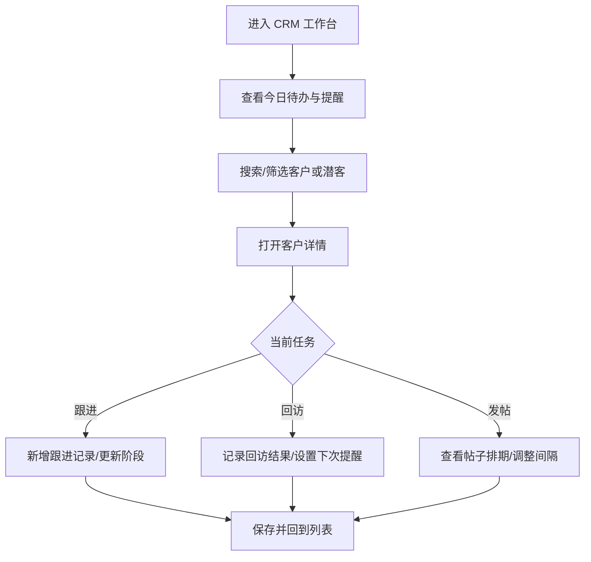

# UI/UX 规范文档

## 文档信息
- **功能名称**：sales-crm
- **版本**：1.0
- **创建日期**：2026-04-15
- **作者**：UI Designer Agent

## 摘要

> 下游 Agent 请优先阅读本节，需要细节时再查阅完整文档。

- **设计风格**：专业、清爽、偏运营工作台，强调信息密度、快速录入、提醒可见性与节奏感
- **主色调**：深海蓝 `#1F4B8F`，辅助青绿 `#0F766E`，警示琥珀 `#D97706`
- **核心组件**：客户列表、客户详情侧栏/详情页、跟进时间轴、回访提醒条、帖子排期日历、间隔提醒卡、快速新增抽屉
- **响应式断点**：Mobile `< 768px` / Tablet `768-1024px` / Desktop `> 1024px`
- **设计系统**：未指定现成 UI 库；建议基于统一设计变量和可复用业务组件实现

---
---

## 1. 设计概述

### 1.1 设计理念
以“销售每天愿意打开、愿意连续用”为目标，采用高密度信息布局、短路径操作和持续提醒机制，让客户跟进、回访与发帖排期都在同一套工作台里完成。视觉上克制、稳定、偏专业运营工具，不使用强装饰或过多动效，所有强调都服务于效率和判断。

### 1.2 设计原则
- **简洁**：单屏优先展示最关键的客户状态、下一步动作和提醒信息，减少页面跳转
- **一致**：客户、潜客、跟进、排期四类对象统一用相同的卡片、标签、时间线和状态表达
- **可访问**：状态色不单独承担信息含义，配合图标、文本和层级表达，保证可读性
- **响应式**：桌面端维持高密度工作台，移动端保留核心列表、详情摘要和快速录入能力

---

## 2. 用户流程

### 2.1 主流程



### 2.2 流程说明

| 步骤 | 页面/组件 | 用户行为 | 系统响应 |
|------|-----------|----------|----------|
| 1 | 工作台首页 | 查看今日提醒、待跟进客户、待发布帖子 | 以卡片和提示条突出最紧急事项 |
| 2 | 客户列表页 | 搜索、筛选、切换客户/潜客 | 列表实时刷新，保留最近筛选条件 |
| 3 | 客户详情页 | 查看资料、浏览历史跟进、补充沟通记录 | 详情内容分区显示，支持快速新增动作 |
| 4 | 帖子排期页 | 查看发帖计划、调整间距、拖拽日期 | 自动校验发帖间距并给出提醒 |
| 5 | 快速录入抽屉 | 新建客户、跟进记录、回访提醒、帖子任务 | 提交后立即反馈，并更新列表状态 |

---

## 3. 设计令牌

### 3.1 颜色系统

#### 主色调
| 名称 | 色值 | 用途 |
|------|------|------|
| Primary | `#1F4B8F` | 主要操作、导航高亮、关键链接 |
| Primary Light | `#2F69C2` | 悬停态、信息高亮 |
| Primary Dark | `#17386A` | 按下态、深色标题条 |

#### 语义色
| 名称 | 色值 | 用途 |
|------|------|------|
| Success | `#0F766E` | 已完成、已跟进、正常间距 |
| Warning | `#D97706` | 即将到期、间距偏紧、待处理提醒 |
| Error | `#DC2626` | 超期、冲突、保存失败 |
| Info | `#2563EB` | 信息提示、引导说明 |

#### 中性色
| 名称 | 色值 | 用途 |
|------|------|------|
| Gray 50 | `#F8FAFC` | 页面背景 |
| Gray 100 | `#F1F5F9` | 浅层区块、表头底色 |
| Gray 300 | `#CBD5E1` | 边框、分割线 |
| Gray 500 | `#64748B` | 辅助文字 |
| Gray 700 | `#334155` | 正文文字 |
| Gray 900 | `#0F172A` | 标题文字 |
| White | `#FFFFFF` | 卡片背景 |

### 3.2 排版系统

| 名称 | 大小 | 行高 | 字重 | 用途 |
|------|------|------|------|------|
| H1 | 32px | 1.2 | 700 | 页面主标题 |
| H2 | 24px | 1.3 | 600 | 区块标题 |
| H3 | 20px | 1.4 | 600 | 卡片标题 |
| Body | 16px | 1.5 | 400 | 主内容 |
| Small | 14px | 1.5 | 400 | 列表辅助信息 |
| Caption | 12px | 1.4 | 400 | 状态说明、时间标注 |

**字体族**：
- 英文：Inter / -apple-system / system-ui
- 中文：PingFang SC / Microsoft YaHei

### 3.3 间距系统

基础单位：8px

| 名称 | 值 | 用途 |
|------|-----|------|
| spacing-1 | 4px | 图标与文字、紧凑标签 |
| spacing-2 | 8px | 组内间距 |
| spacing-3 | 12px | 表单项局部间距 |
| spacing-4 | 16px | 默认卡片内边距 |
| spacing-5 | 20px | 组件分隔 |
| spacing-6 | 24px | 区块内边距 |
| spacing-8 | 32px | 区块之间间距 |
| spacing-10 | 40px | 页面主区块间距 |

### 3.4 圆角

| 名称 | 值 | 用途 |
|------|-----|------|
| rounded-sm | 4px | 小标签、表格元素 |
| rounded-md | 6px | 输入框、按钮 |
| rounded-lg | 10px | 卡片、抽屉内容区 |
| rounded-xl | 14px | 弹层、重点面板 |
| rounded-full | 9999px | 胶囊标签、状态点 |

### 3.5 阴影

| 名称 | 值 | 用途 |
|------|-----|------|
| shadow-sm | `0 1px 2px rgba(15,23,42,0.06)` | 轻层分隔 |
| shadow-md | `0 6px 18px rgba(15,23,42,0.08)` | 卡片浮层 |
| shadow-lg | `0 12px 32px rgba(15,23,42,0.12)` | 抽屉、下拉面板 |
| shadow-xl | `0 20px 40px rgba(15,23,42,0.16)` | 模态框 |

### 3.6 动效系统

| 名称 | 时长 | 缓动函数 | 用途 |
|------|------|----------|------|
| duration-fast | 120ms | ease-out | hover、focus、按钮反馈 |
| duration-normal | 220ms | ease-in-out | 抽屉、折叠、筛选切换 |
| duration-slow | 320ms | ease-in-out | 页面切换、日历视图变化 |

---

## 4. 组件规范

### 4.1 按钮 (Button)

#### 变体

| 变体 | 用途 | 视觉特征 |
|------|------|----------|
| Primary | 新建客户、保存跟进、确认排期 | 实心主色 |
| Secondary | 切换视图、辅助操作 | 描边、透明背景 |
| Ghost | 表格行内轻操作 | 无边框、低视觉权重 |
| Danger | 删除、作废、取消排期 | 红色强调 |

#### 尺寸

| 尺寸 | 高度 | 内边距 | 字号 |
|------|------|--------|------|
| sm | 32px | 10px 12px | 14px |
| md | 40px | 12px 16px | 14px |
| lg | 44px | 14px 20px | 16px |

#### 状态

| 状态 | 处理方式 |
|------|----------|
| 默认 | 维持高对比度，便于在密集界面中快速定位 |
| 悬停 | 亮度轻微提升，避免过强跳动 |
| 按下 | 轻微下压，确认已触发 |
| 聚焦 | 显示清晰描边，支持键盘操作 |
| 禁用 | 降低对比度，保留文案可读性 |
| 加载 | 按钮内显示 spinner，避免重复提交 |

### 4.2 输入框 (Input)

#### 变体

| 变体 | 用途 |
|------|------|
| Text | 姓名、公司、标签等单行文本 |
| Search | 客户搜索、快速查找 |
| Select | 阶段、来源、负责人、状态 |
| Textarea | 跟进记录、备注、帖子说明 |
| Date / Datetime | 回访提醒、排期日期、发帖时间 |

#### 状态

| 状态 | 边框颜色 | 说明 |
|------|----------|------|
| 默认 | `Gray 300` | 标准状态 |
| 聚焦 | `Primary` | 进入编辑态 |
| 错误 | `Error` | 校验失败，显示文案提示 |
| 禁用 | `Gray 300` + 浅底色 | 不可编辑 |

### 4.3 标签 (Tag / Badge)

| 类型 | 颜色 | 用途 |
|------|------|------|
| 客户阶段 | 蓝系 | 潜客、跟进中、已成交、待回访 |
| 提醒状态 | 橙/红系 | 即将到期、超期、冲突 |
| 发帖状态 | 青/灰系 | 已排期、待发布、已发布、延后 |

**设计要点**：
- 标签宽度尽量自适应，避免截断关键信息
- 状态标签始终配合文字，不只依赖颜色识别
- 列表中标签不超过 2 层，保持横向密度

### 4.4 列表 (Table / Dense List)

| 属性 | 规范 |
|------|------|
| 行高 | 52px，重要列表可降至 48px |
| 表头 | 浅底色 + 粗体标题 |
| 行态 | 悬停高亮，选中态左侧增加主色条 |
| 操作 | 行尾固定 2-3 个高频动作，其余收纳到更多菜单 |

**推荐列**：
- 客户列表：姓名、公司/来源、阶段、负责人、最近跟进、下次回访、风险提示、操作
- 帖子排期：平台、主题、计划发布时间、间隔状态、负责人、状态、操作

### 4.5 详情侧栏 / 抽屉 (Drawer)

| 属性 | 规范 |
|------|------|
| 宽度 | Desktop 480-560px，Tablet 100% 宽，Mobile 底部全屏 |
| 结构 | 头部摘要 + 主体内容 + 底部固定操作栏 |
| 用途 | 快速查看客户摘要、补充跟进、编辑回访、调整排期 |

**适用场景**：
- 从列表直接快速处理，不打断主列表上下文
- 在移动端代替完整详情页，降低页面层级

### 4.6 时间轴 (Timeline)

| 组成 | 说明 |
|------|------|
| 节点 | 跟进记录、回访记录、提醒触发、帖子调整 |
| 时间线 | 左侧细线，节点按时间倒序排列 |
| 内容 | 文本摘要、操作人、时间、状态变化、附件入口 |

**设计要点**：
- 最近一次跟进默认展开，历史记录默认折叠
- 重要节点用更强的标题和状态点突出
- 支持按类型筛选：沟通、回访、成交、排期变更

### 4.7 日历 / 排期条

| 组件 | 用途 |
|------|------|
| 月视图日历 | 看整体节奏，判断发帖是否过密或断档 |
| 周视图时间轴 | 看具体发布时间、负责人、平台 |
| 排期条 | 在单周内展示连续发帖节奏与间隔 |

**规则**：
- 相邻发帖间隔小于设定阈值时标记为 Warning
- 超过阈值未发帖时在日期格内显示空档提醒
- 支持拖拽调整日期，但变更前必须二次确认

### 4.8 提醒条 (Reminder Banner)

| 类型 | 展示位置 | 内容 |
|------|----------|------|
| 今日待回访 | 工作台顶部 | 到期客户数量、最紧急客户、快速处理入口 |
| 发帖过密 | 排期页顶部 | 间隔冲突描述与建议调整 |
| 断更提醒 | 排期页空状态 | 距离上次发帖时间与建议补发动作 |

---

## 5. 页面设计

### 5.1 客户列表页

#### 页面信息

| 属性 | 值 |
|------|-----|
| 路由 | `/customers` |
| 标题 | 客户与潜客 |
| 描述 | 用于快速检索、筛选和批量处理客户与潜在客户 |

#### 页面结构

```
┌─────────────────────────────────────────────────────────┐
│ 顶部导航：标题 / 全局搜索 / 快速新建 / 今日提醒         │
├───────────────┬─────────────────────────────────────────┤
│ 筛选区         │ 客户列表（高密度表格 / 列表）          │
│ - 阶段         │ - 姓名 / 公司 / 来源 / 阶段            │
│ - 负责人       │ - 最近跟进 / 下次回访 / 风险提示        │
│ - 回访状态     │ - 行内操作                              │
│ - 标签         │                                         │
└───────────────┴─────────────────────────────────────────┘
```

#### 区块详细设计

**区块 1：顶部操作栏**

| 元素 | 类型 | 规格 | 交互 |
|------|------|------|------|
| 页面标题 | H1 | 32px, 700, Gray 900 | - |
| 全局搜索 | Input/Search | 支持姓名、公司、电话、标签 | 输入即筛选 |
| 快速新建 | Button/Primary | 44px | 打开新建客户抽屉 |
| 今日提醒入口 | Badge + Button | 显示未处理数量 | 跳转提醒列表 |

**区块 2：左侧筛选栏**

| 元素 | 类型 | 规格 | 交互 |
|------|------|------|------|
| 阶段筛选 | Select / Chips | 潜客、跟进中、待回访、已成交 | 多选 |
| 回访状态 | Select | 今日、3天内、超期 | 单选 |
| 负责人 | Select | 按团队成员过滤 | 单选 |
| 标签 | Chips | 支持多标签 | 多选 |

**区块 3：客户列表**

| 元素 | 类型 | 规格 | 交互 |
|------|------|------|------|
| 数据行 | Dense Table Row | 52px 高度 | 点击进入详情 |
| 风险提示 | Tag / Icon | 超期、连续未跟进、发帖冲突关联 | 悬浮显示说明 |
| 行内操作 | Button / Ghost | 跟进、回访、编辑 | 打开抽屉或弹层 |

#### 响应式设计

| 断点 | 布局调整 |
|------|----------|
| < 640px (mobile) | 列表改为卡片式单列，筛选收纳进底部抽屉，保留搜索和新建按钮 |
| 640-1024px (tablet) | 左侧筛选栏折叠，可一键展开；列表维持两到三列关键信息 |
| > 1024px (desktop) | 左侧筛选栏固定展示，列表采用高密度表格 |

### 5.2 客户详情页

#### 页面信息

| 属性 | 值 |
|------|-----|
| 路由 | `/customers/:id` |
| 标题 | 客户详情 |
| 描述 | 集中查看客户资料、跟进历史、回访提醒与后续动作 |

#### 页面结构

```
┌─────────────────────────────────────────────────────────┐
│ 客户摘要头部：姓名 / 阶段 / 负责人 / 下次回访 / 操作     │
├──────────────────────┬──────────────────────────────────┤
│ 左侧：基础信息       │ 右侧：跟进时间轴 / 回访提醒      │
│ - 客户资料           │ - 最新跟进                       │
│ - 标签               │ - 历史记录                       │
│ - 联系方式           │ - 快速新增跟进                   │
│ - 来源与备注         │                                  │
└──────────────────────┴──────────────────────────────────┘
```

#### 区块详细设计

**区块 1：客户摘要头部**

| 元素 | 类型 | 规格 | 交互 |
|------|------|------|------|
| 姓名 + 阶段 | Text + Badge | 重点突出 | 点击可快速改阶段 |
| 下次回访 | Reminder Chip | 显示倒计时或超期 | 点击编辑提醒 |
| 快速操作 | Button 群组 | 跟进、回访、编辑、归档 | 打开对应抽屉 |

**区块 2：基础信息卡**

| 元素 | 类型 | 规格 | 交互 |
|------|------|------|------|
| 资料字段 | Key-Value List | 公司、电话、来源、标签、备注 | 支持局部编辑 |
| 联系方式 | 可复制文本 | 一键复制电话/微信 | 提示复制成功 |
| 风险说明 | Info Banner | 连续未跟进、沉默时长 | 用自然语言解释原因 |

**区块 3：跟进时间轴**

| 元素 | 类型 | 规格 | 交互 |
|------|------|------|------|
| 时间轴节点 | Timeline Item | 倒序排列 | 展开/收起详情 |
| 最新记录 | Expanded Card | 默认展开 | 编辑、补充附件、置顶摘要 |
| 新增记录入口 | Button / Primary | 固定在区域顶部或底部 | 打开快速录入抽屉 |

#### 响应式设计

| 断点 | 布局调整 |
|------|----------|
| < 640px (mobile) | 头部摘要折叠为两行，基础信息与时间轴上下排列，快速操作固定底部栏 |
| 640-1024px (tablet) | 两列布局，时间轴占主要宽度 |
| > 1024px (desktop) | 左信息右时间轴，保持固定宽度摘要区，便于连续浏览 |

### 5.3 帖子排期页

#### 页面信息

| 属性 | 值 |
|------|-----|
| 路由 | `/posts/schedule` |
| 标题 | 帖子排期 |
| 描述 | 管理营销帖子发布时间、发帖间距与断更提醒 |

#### 页面结构

```
┌─────────────────────────────────────────────────────────┐
│ 顶部提醒条：间隔冲突 / 断更风险 / 今日建议发帖         │
├───────────────┬─────────────────────────────────────────┤
│ 侧栏：筛选     │ 主区：月视图日历 / 周排期条            │
│ - 平台         │ - 发帖计划                             │
│ - 负责人       │ - 间距状态                             │
│ - 状态         │ - 拖拽/调整                            │
└───────────────┴─────────────────────────────────────────┘
```

#### 区块详细设计

**区块 1：提醒条**

| 元素 | 类型 | 规格 | 交互 |
|------|------|------|------|
| 间隔冲突提示 | Warning Banner | 显示冲突数量与建议日期 | 点击定位冲突项 |
| 断更提示 | Error/Warning Banner | 显示距离上次发帖天数 | 点击进入建议排期 |
| 今日发帖建议 | Info Chip | 建议今天是否发布 | 一键创建排期 |

**区块 2：日历/排期视图**

| 元素 | 类型 | 规格 | 交互 |
|------|------|------|------|
| 月视图格子 | Calendar Cell | 显示当天帖子数量与状态 | 点击展开当天任务 |
| 周排期条 | Schedule Bar | 显示连续节奏 | 支持拖拽调整日期 |
| 任务卡片 | Mini Card | 平台、主题、负责人、状态 | 打开详情抽屉 |

**区块 3：排期详情抽屉**

| 元素 | 类型 | 规格 | 交互 |
|------|------|------|------|
| 计划信息 | Form | 平台、发布时间、标题、备注 | 可编辑 |
| 间隔校验 | Inline Hint | 自动提示前后间隔是否合规 | 保存前确认 |
| 相关客户 | Chip List | 可关联客户或活动 | 快速跳转 |

#### 响应式设计

| 断点 | 布局调整 |
|------|----------|
| < 640px (mobile) | 日历默认切换为周视图，提醒条置顶，拖拽改为按钮式日期选择 |
| 640-1024px (tablet) | 月视图与周视图可切换，侧栏折叠为抽屉 |
| > 1024px (desktop) | 左侧筛选栏常驻，右侧保持完整日历和排期条 |

### 5.4 快速录入抽屉

#### 页面信息

| 属性 | 值 |
|------|-----|
| 形式 | 抽屉 / 底部面板 |
| 用途 | 新建客户、补充跟进、设置回访、创建帖子排期 |

#### 页面结构

```
┌──────────────────────────────┐
│ 标题 + 关闭                 │
├──────────────────────────────┤
│ 表单主体                     │
│ - 基础信息                   │
│ - 状态 / 提醒                │
│ - 备注 / 附件                │
├──────────────────────────────┤
│ 底部固定按钮：取消 / 保存     │
└──────────────────────────────┘
```

#### 设计要点
- 表单字段按使用频率排序，先放最常录入的信息
- 日期、阶段、负责人等高频项使用下拉或快捷选项，减少键盘输入
- 保存成功后提供轻提示，不打断用户继续处理下一条

---

## 6. 交互规范

### 6.1 加载状态

| 场景 | 处理方式 | 时机 |
|------|----------|------|
| 页面首次加载 | 骨架屏 | 进入页面时 |
| 列表刷新 | 区域级轻遮罩 | 筛选、搜索、分页 |
| 保存操作 | 按钮 spinner + 按钮禁用 | 提交后立即触发 |
| 日历切换 | 局部过渡动画 | 月/周视图切换 |

### 6.2 空状态

| 场景 | 展示内容 | 操作引导 |
|------|----------|----------|
| 客户列表无数据 | 简短说明 + 新建客户按钮 | 立即新增首个客户 |
| 跟进记录为空 | 提示“先完成一次沟通记录” | 新建跟进 |
| 排期为空 | 提示“还没有发帖计划” | 创建第一条排期 |
| 搜索无结果 | 提示当前筛选过窄 | 清空筛选或调整关键词 |

### 6.3 错误状态

| 场景 | 反馈方式 | 处理建议 |
|------|----------|----------|
| 发帖间隔冲突 | 页面顶部 Warning + 冲突项高亮 | 调整日期或合并内容 |
| 回访已超期 | 客户卡片红色提醒 + 时间标注 | 一键创建回访任务 |
| 保存失败 | Toast + 表单字段提示 | 保留已输入内容，允许重试 |

### 6.4 信息密度与节奏感

- 列表页优先展示“谁、什么时候、什么状态、下一步做什么”，避免把非关键字段放在首屏
- 回访提醒使用倒计时、超期时长、颜色和文案四重表达，保证在密集列表中一眼可见
- 发帖排期采用日历与节奏条双视图，让用户同时看到“具体日期”和“整体节奏”
- 对高频操作提供固定入口，减少用户在列表、详情和抽屉之间来回找按钮

---

## 7. 无障碍要求

### 7.1 对比度
- 正文文字/背景：≥ 4.5:1
- 大文字/背景：≥ 3:1
- UI 元素：≥ 3:1

### 7.2 键盘导航
- 所有交互元素可通过 Tab 访问
- 重要表单支持 Enter 提交、Esc 关闭抽屉
- 列表行与排期卡片提供清晰焦点态

### 7.3 屏幕阅读器
- 所有图标按钮有可读标签
- 状态标签同时输出文本与颜色信息
- 错误信息与提醒文案可被读取并定位到具体字段

---

## 变更记录

| 版本 | 日期 | 作者 | 变更内容 |
|------|------|------|----------|
| 1.0 | 2026-04-15 | UI Designer Agent | 初始版本 |
